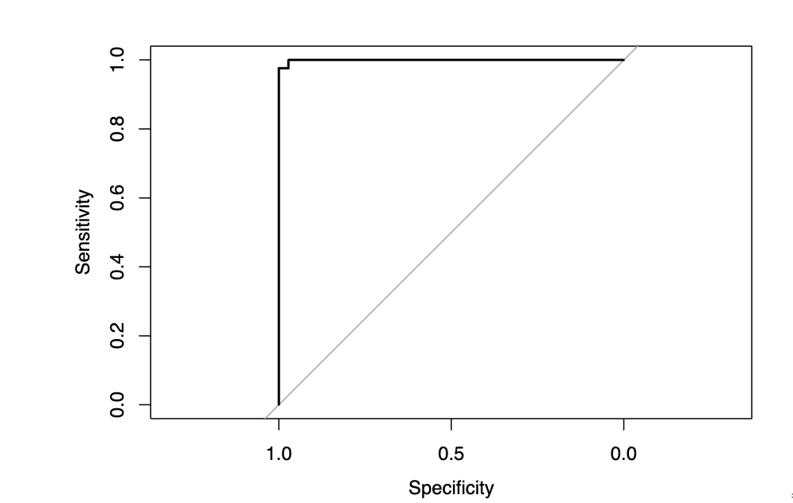

# Breast Cancer Classification using Logistic Regression and Lasso

## Overview
This project builds and evaluates models to classify breast tumors as benign or malignant using clinical measurement data.

A baseline logistic regression model is compared with a regularized (Lasso) model to improve interpretability and reduce feature redundancy.

---

## Key Results
- Logistic Regression AUC: ~0.96  
- Lasso Model AUC: 0.999  
- Accuracy: 98.2%  
- Reduced features from 30+ to 8 predictors  

The regularized model achieved near-perfect classification performance while significantly simplifying the feature set.

---

## Key Insight
Tumor shape and boundary features (e.g., concave points, symmetry) were more important predictors than size-based features.

This suggests that morphological complexity plays a larger role in malignancy classification.

---

## Methods
- Logistic Regression (baseline)
- 5-fold Cross Validation
- Lasso Regularization (glmnet)
- ROC / AUC evaluation

---

## Example Outputs

### ROC Curve


### Selected Features (Lasso)
- concave_points_mean  
- concave_points_worst  
- radius_worst  
- smoothness_worst  
- symmetry_worst  
- texture_worst  
- concavity_worst  
- radius_se  

---

## Project Structure
```
breast-cancer-classification/
├── breast_cancer_analysis.Rmd
├── breast_cancer_analysis.pdf
├── data/
│   └── data.csv
```

---

## How to Run
1. Clone the repository  
2. Open the `.Rmd` file in RStudio  
3. Knit the document to reproduce results  

---

## Notes
This dataset exhibits strong separation between benign and malignant tumors, which contributes to the high model performance. Results may not generalize as strongly to more complex real-world datasets.

---

## Author
Nicholas Kaufman
